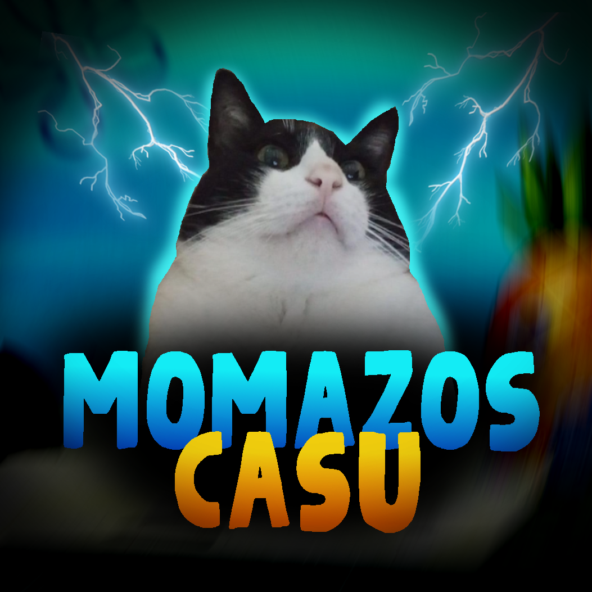

# 

# CasuBot
Este es Casu. Es un bot de Discord.

## Funciones

Las funciones de casu son las siguientes:

### Reproducir música

CasuBot puede reproducir música para tus VCs. Actualmente dispone de reproducción desde Youtube, Spotify y archivos MP3 / MP4. Más información con c!help music

### Chatear con IA

CasuBot tiene un IA conversacional integrado a él para que puedas conversar con él. Si le haces ping, responderá. Más información con c!help chat

### Generar globos de texto

Añade una imagen, escribe el comando c!globo, y verás la magia. c!help globo

### Generar momazos

Añade una imagen (plantilla), escribe un poco de texto, y se generará un momo. El momo puede tener múltiples plantillas en general. c!help momo

### Celebrar cumpleaños

Cada usuario puede añadir su cumpleaños a la base de datos, y cuando llegue la fecha, si existe un rol y un canal asignado, CasuBot le deseará feliz cumpleaños por ese canal y le asignará el rol al usuario por un día entero. c!help cum (jaja entendiste es cum porque cumpleaños pero es como cum de-)

(Por cierto, para los admins, existen 2 comandos exclusivos para admins en el código)

### Enviar shitposts

Cada que envías un mensaje por algún canal, CasuBot tiene una probabilidad de 1 en 1000 de responder con un shitpost al azar de una colección (que por cierto no me pertenece, así que no me hago cargo de la calidad de los shitposts). c!help shitpost

### Cubixear

SHoT_TheCuBiXo. c!help cubixo

### Hablar (???)

Escribe "c!talk hola" y CasuBot dirá "hola". Es de sobra la función mas inutil del bot. c!help talk

## Requisitos

Debes correr el archivo main.py. Para ello también necesitarás de lo siguiente:

### Instalar requirements.txt

```pip install -r requirements.txt```

### Token de bot de Discord

Este lo consigues en el Developer Portal de Discord.

https://discord.com/developers/applications

### Youtube API Key

Este lo consigues en Google Cloud Console.

https://console.cloud.google.com

### Spotify Client ID / Secret

Este lo consigues en Spotify for Developers

https://developer.spotify.com/dashboard

### Usuario y contraseña de Spotify

Este se explica solo

### ChatGPT API Key

Este lo consigues en la plataforma de OpenAI

https://platform.openai.com

### Archivo .env

Creas un archivo llamado ".env" que tome la siguiente forma:

```
# Discord
DISCORD_TOKEN = "DISCORD TOKEN"

# Youtube
YOUTUBE_API_KEY = "YOUTUBE API KEY"

# Spotify
SPOTIFY_CLIENT_ID = "SPOTIFY CLIENT ID"
SPOTIFY_CLIENT_SECRET = "SPOTIFY CLIENT SECRET"

SPOTIFY_USER = "SPOTIFY USERNAME"
SPOTIFY_PASS = "SPOTIFY PASSWORD"

# ChatGPT
GPT_API_KEY = "CHATGPT API KEY"
```

## Nota final

Si alguien esta leyendo esto por algun motivo... Este es mi primer proyecto a esta escala con repo de GitHub pública y eso. Más que nada era un proyecto para intentar practicar lo que he estado aprendiendo de código limpio, aunque no se si en verdad mi código sea muy limpio la verdad, pero así se aprende supongo? Cualquier cosa, si te sientas a leer el código pues si quieres escríbeme en Discord si quieres sobre la calidad del código. Así se aprende supongo. d4rkmn en Discord